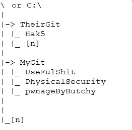

# GoldenSnapshoter
A Python3 script to create and maintain a “Golden Image” of VMs in VMWare Workstation (for the moment) on either a Windows or Linux host... 

This saves deleting the VM, downloading the VM and then updating it, download all the Git repos, download your git repos (or committing them so you don't loose code) everytime time you mess up a VM or in the case of Pentesters when you start work on a new job start fresh but updated!

With GoldenSnapshoter your VMs, have your Git repos have a commit done (so you don't loose your code), they are then reset to your current golden image, the guest OS is updated, yours and third party Git repos are updated/downloaded and then that is saved as your new "Golden Image".

WARNING!!! This removes any unwanted (or possiblely wanted) data from the VM, be sure to move any wanted data off the VM prior to running the Script WARNING!!!

### The Initial Setup ###
#### Physical Host Configuration ####
1. Install Python3
2. Install VMWare Workstation
3. Implement VirtualMachines Folder Structure  
		example: \VirtualMachines\Clients\Windows10 or C:\VirtualMachines\Clients\Windows10

#### Create Your VM(s) ####
(Remember there are ways to script an initial build of a VM... go have a look)
1. Create your VM - Download and Create your Guest VM with the OS of your choice
2. Install any additional items you want included in your Image - Favourite Browser, Additional Tools, Password Manager, Git Repos
3. Configure your VM - also see "VM Additional Configuration" below
4. Copy appropriate Update Script onto VM into /Update.[n]
5. Update your OS (do any needed reboots)
6. Shutdown your VM and Create a Snapshot called "BaseImage"

#### VM Additional Configuration ####
1. An understanding of that OS and its update mechanisms
2. Copy appropriate UpdateWith[n].[n] to \ or C:\ rename to Update.[n] 
		example: Copy UpdateWithAPT.sh to \Update.sh for a Ubuntu guest 
		example: For a custom *nix Guest create a script called Update.sh (*nix) in \  
		example: For a custom Windows Guest create a script called Update.ps1 in C:\  
3. Install Git
4. Configure Git Profile
5. Implement GIT folder structure  
		example: \TheirGit\Hak5 or C:\TheirGit\Hak5
		example: \MyGit\GoldenSnapshoter or C:\MyGit\GoldenSnapshoter

