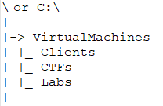

# GoldenSnapshoter
A Python3 script to create and maintain a “Golden Image” of VMs in VMWare Workstation (for the moment) on either a Windows or Linux host...

This saves deleting the VM, downloading the VM and then updating it, download all the Git repos, download your git repos everytime time you mess up a VM or in the case of Pentesters when you start work on a new job start fresh but updated!

With GoldenSnapshoter your VMs, is reset to your current golden image, the guest OS is updated, your's and third party Git repos are downloaded and then that is saved as your new "Golden Image".

WARNING!!! This removes any unwanted (or possiblely wanted) data from the VM, be sure to move any wanted data off the VM, or commit any local changes in your Git repos prior to running the Script WARNING!!!

### The Initial Setup ###
#### Physical Host Configuration ####
1. Install Python3
2. Install VMWare Workstation
3. Add path to vmrun to your host's path
4. Implement VirtualMachines Folder Structure
5. Modify settings in settings.py to suit your environment

a folder structure example: \VirtualMachines\Clients\Windows10 or C:\VirtualMachines\Clients\Windows10

If you dont want all of your VMs snapshotted put them in a good folder structure. I usually only want to snapshot my "Clients" but not my CTFs. So I would do C:\VirtualMachines\Clients 

#### Create Your VM(s) ####
(Remember there are ways to script an initial build of a VM... go have a look)
1. Create your VM - Download and Create your Guest VM with the OS of your choice
2. Install python3, dos2unix and VMWare tools (or open vm tools)
3. Install any additional items you want included in your Image - Favourite Browser, Additional Tools, Password Manager, Git Repos
4. Configure your VM
5. Shutdown your VM

### Usage ###
1. Configure all the variables in settings.py to match your environment
    (pay particular attention to the preserve_for_forensic_evidence setting(s))
2. python ./GoldenSnapshoter.py

if you utilise the Git generation script. You need to manually copy the contents of the script into the particular VM's UpdateScript.py

This was design specifically to be a manual process as on some hosts you may not want Git repos...

#### Things to know ####
1. You need to change the settings and supply information including usernames and passwords - Be Mindful of This!
2. Private Git Repos require authentication there is an example in the settings of how to add you repo with a username and password... if you do not it will no clone the repo and may cause errors
3. dos2unix is required as VMWare seems to copy/convert the UpdateScript to have dos end of line characters
4. ParrotOS was one of our test cases however it handles `sudo apt update -y && sudo apt dist-upgrade -y` where it does not honour the `-y` flag on ocassions. This is due to their different implementation of Aptitude
5. Timing run this regularly, if it has been a while we suggest a manual restore to base image and update (especially with ParrotOS). Also only run it once a day usually this isn't an issue
